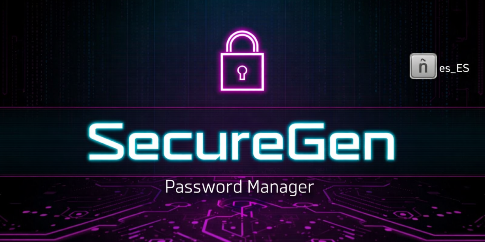
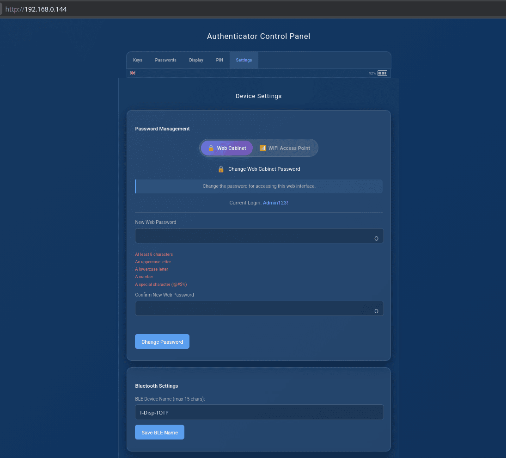
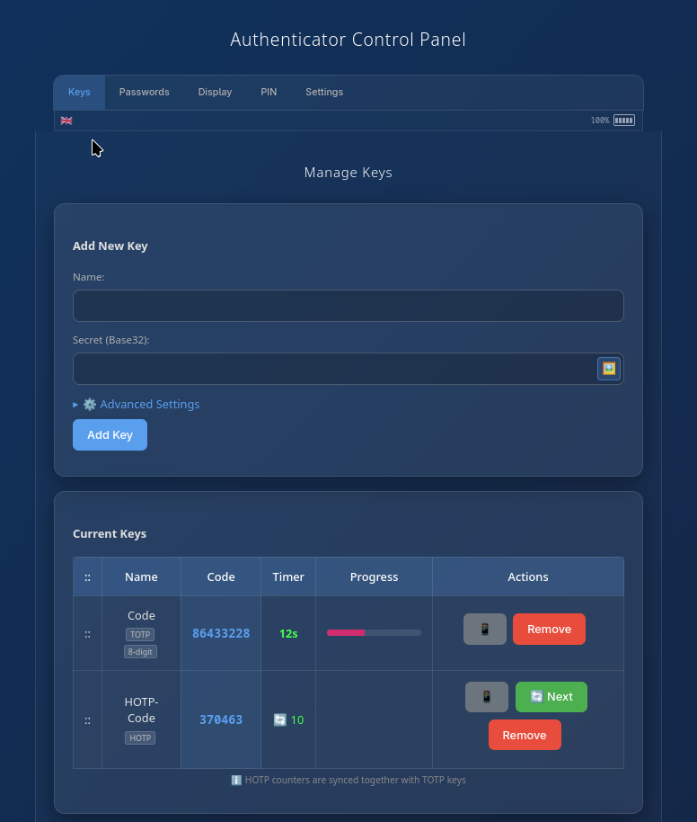
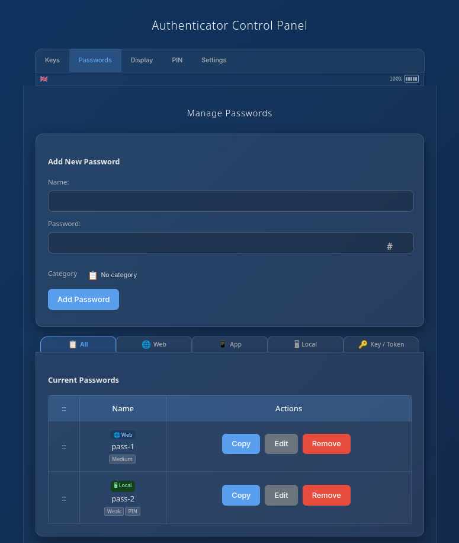
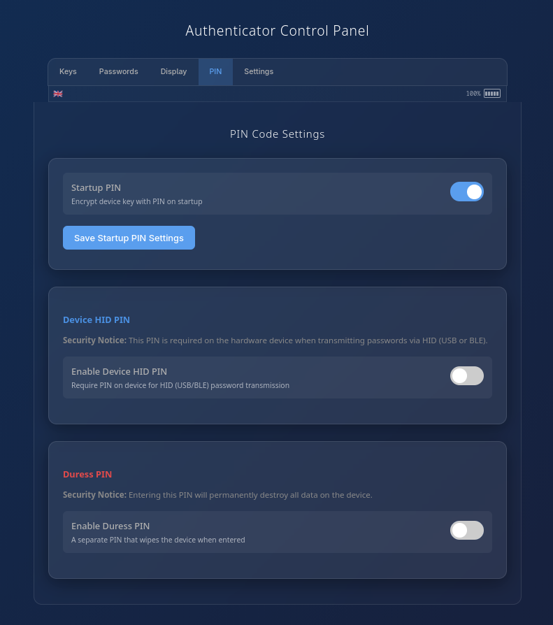

<div align=center></div>

# Dispositivo de Seguridad Multifuncional ESP32 T-Display/S3

<div align="center">

**Este es un folk del repositorio https://github.com/makepkg/SecureGen**

**Open-source hardware security device featuring TOTP Authenticator and Password Manager with BLE/USB HID es_ES Layout**

*Soporta T-Display ESP32 y T-Display-S3 adaptado a teclado español y sin caracteres ambiguos en generador de claves*

Cararteres soportados:
<br>*abcdefghijklmnñopqrstuvwxyzABCDEFGHJKLMNÑOPQRSTUVWXYZ23456789*
<br>*!@#$%&/()=?,;.:-_áéíóúÁÉÍÓÚäëïöüÄËÏÖÜâêîôûÂÊÎÔÛ*

[](https://opensource.org/licenses/MIT)
[](https://platformio.org/)
[](https://www.espressif.com/)

</div>

---

## 📸 Device Gallery

<div align="center">
  
  <br/>
  <b>T-Display ESP32 & S3 — Dual Board Showcase</b>
  <br/>
  <i>ESP32 (left) running TOTP authenticator · S3 (right) running password manager with larger 1.9" display</i>
</div>

<br/>

### Device Features & Modes
<table>
  <tr>
    <td align="center" width="33%">
      
      <br/><b>TOTP Mode (Dark Theme)</b>
      <br/>Real-time authentication codes
    </td>
    <td align="center" width="33%">
      
      <br/><b>TOTP Mode (Light Theme)</b>
      <br/>Customizable display themes
    </td>
    <td align="center" width="33%">
      
      <br/><b>HOTP Mode (Light Theme)</b>
      <br/>Counter-based authentication
    </td>
  </tr>
  <tr>
    <td align="center" width="33%">
      
      <br/><b>Password Manager Mode</b>
      <br/>Secure offline password vault
    </td>
    <td align="center" width="33%">
      
      <br/><b>T-Display-S3 Close-up</b>
      <br/>1.9" display, USB HID support
    </td>
    <td align="center" width="33%">
      
      <br/><b>QR Code Export</b>
      <br/>Export keys directly from display
    </td>
  </tr>
</table>

### Hardware & Settings
<table>
  <tr>
    <td align="center" width="33%">
      
      <br/><b>Hardware Comparison</b>
      <br/>ESP32 (1.14") vs S3 (1.9")
    </td>
    <td align="center" width="33%">
      
      <br/><b>Battery & Status</b>
      <br/>Real-time monitoring
    </td>
    <td align="center" width="33%">
      
      <br/><b>BLE Security Mode</b>
      <br/>Encrypted wireless transmission
    </td>
  </tr>
  <tr>
    <td align="center" width="33%">
      
      <br/><b>Boot Mode Selection</b>
      <br/>WiFi / AP / Offline at startup
    </td>
    <td align="center" width="33%">
      
      <br/><b>Factory Reset</b>
      <br/>Secure data wiping
    </td>
    <td align="center" width="33%"></td>
  </tr>
</table>

### Web Management Interface
<table>
  <tr>
    <td align="center" width="33%">
      
      <br/><b>Dashboard</b>
      <br/>Secure web access
    </td>
    <td align="center" width="33%">
      
      <br/><b>TOTP Management</b>
      <br/>QR code scanning & bulk import
    </td>
    <td align="center" width="33%">
      
      <br/><b>Password Vault</b>
      <br/>Encrypted storage & search
    </td>
  </tr>
  <tr>
    <td align="center" width="33%">
      
      <br/><b>Security Settings</b>
      <br/>PIN & authentication config
    </td>
    <td align="center" width="33%">
      
      <br/><b>Device Configuration</b>
      <br/>Network & display settings
    </td>
    <td align="center" width="33%">
      
      <br/><b>Password Generator</b>
      <br/>Advanced generation & statistics
    </td>
  </tr>
</table>

---

## 🎥 Video

<div align="center">

[](https://www.youtube.com/watch?v=YTVQBwgok_E)

**Watch the full demonstration** — TOTP generation, password management, BLE keyboard, and web interface.

[▶️ Watch on YouTube](https://www.youtube.com/watch?v=YTVQBwgok_E)

<br/><br/>


</div>

---

## ✨ Key Features

### 🔐 TOTP / HOTP Authenticator
- Compatible with Google Authenticator, Microsoft Authenticator, Authy, and all RFC 6238 / RFC 4226 services
- SHA1 / SHA256 / SHA512, 6 and 8 digit codes, 30s and 60s periods
- HOTP counter-based codes with automatic counter increment
- Add keys via QR code scan (camera or file), manual entry, or bulk import
- Export any key as QR code — displayed on the device screen and in the web interface
- Encrypted storage with unique per-device key

### 🔑 Password Manager
- Offline encrypted vault — works without any network connection
- **BLE HID keyboard** (ESP32 & S3): types passwords directly into any device, no clipboard
- **USB HID keyboard** (S3 only): native USB connection, no pairing needed, **es_ES Layout**
- PIN protection for BLE transmission
- Encrypted export/import for backup and migration

### 🔒 Hidden Space
- **Two independent vaults** — alternate PIN at boot unlocks a fully isolated 
  second space with its own TOTP keys, passwords, and web cabinet account 
- **Optional WiFi sharing** — Space B can inherit Space A WiFi credentials 
  with one toggle; disabled by default 
- **Full isolation** — separate BLE PIN, web admin credentials, and session 
  per space; spaces cannot read each other's data 

### 🌐 Web Management Interface
- Runs on the device itself — no cloud, no external servers
- Full TOTP and password management from any browser
- Password generator with complexity settings whithout ambiguos characters (I, 1, 0)
- Alphabet es_ES Lauyout, keys: 
  * Lower case : **abcdefghijklmnopqrstuvwxyzñáéíóúäëïöüâêîôû**
  * Upper case : **ABCDEFGHJKLMNOPQRSTUVWXYZÑÁÉÍÓÚÄËÏÖÜÂÊÎÔÛ**, whitout I.
  * Numbers : **23456789** , whithout 0 and 1.
  * Symbols: **!@#$%&/()=?,;.:-_**
- Three network modes: WiFi client, AP hotspot, or fully offline
- Multilingual interface — English, Russian, German, Chinese (Simplified), and Spanish

### 🎨 Display & Themes
- Light and dark themes, switchable from the web interface
- Custom splash screens on boot
- Battery indicator and WiFi status always visible

### ⚡ Hardware

**Supported Boards:**
- **T-Display ESP32** — dual-core 240MHz, 1.14" SPI display (135×240), BLE HID keyboard
- **T-Display-S3** — dual-core 240MHz, 1.9" parallel display (170×320), 8MB PSRAM, **USB HID + BLE HID** keyboard support

**Features:**
- Battery monitoring with real-time voltage and percentage
- Deep sleep and light sleep power saving
- **DS3231 RTC module support** — accurate offline timekeeping without WiFi; enables TOTP in AP and Offline modes
- **USB HID on S3** — type passwords via native USB connection (no BLE pairing needed), better performance with AES encryption

---

## 🛡️ Security

All sensitive data is encrypted with AES-256 using a unique per-device key derived from your PIN via PBKDF2-HMAC-SHA256. The web interface runs over an HTTPS-like encrypted channel (ECDH P-256 key exchange + AES-256-GCM) — works even in AP mode without certificates.

**8 layers of web protection:** key exchange → session encryption → URL obfuscation → header obfuscation → decoy traffic → method tunneling → timing protection → honeypot endpoints.

**Device security:** PIN with persistent lockout (5 attempts across reboots), secure memory wipe before deep sleep, encrypted BLE pairing.

**Hidden Space:** two-slot device key file; Space B unlocked only by its own PIN via independent PBKDF2 derivation; wipe zeroes slot and deletes all HMAC-derived files.

### Known Limitations
- PBKDF2 iteration count (25,000) is below OWASP 2023 recommendations due to ESP32 hardware constraints
- No hardware secure enclave or secure boot by default
- Active MITM on initial ECDH exchange is not detectable without a server certificate

→ [Security Overview](docs/development/security/SECURITY_OVERVIEW.md) — full security summary  
→ [Security Model](docs/development/security/security_model.md) — technical reference for developers and auditors

---

## 🎮 Device Controls

| Button | Action | Function |
|--------|--------|----------|
| **Button 1** (Top) | Short press | Previous item |
| | Long press 2s | Switch TOTP ↔ Password Manager |
| **Button 2** (Bottom) | Short press | Next item |
| | Long press 5s | Power off (deep sleep) |
| **Both buttons** | 2s in Password Mode | Activate BLE keyboard |
| | 5s on PIN screen | Shutdown |
| | 5s on boot | Factory reset |

Wake from sleep: press Button 2.

---

## 🚀 Quick Start

### Requirements
- [PlatformIO](https://platformio.org/platformio-ide) (VS Code extension)
- LILYGO® TTGO T-Display ESP32 **or** T-Display-S3
- USB-C cable

### ⚡ No tools? Flash from browser
[**→ Web Flasher**](https://RafaelReyesCarmona.github.io/SecureGen-es_ES/flash) — Chrome/Edge + USB, no install needed  
[**→ User Guide**](https://RafaelReyesCarmona.github.io/SecureGen-es_ES/guide)  
[**→ Decrypt Export Tool**](https://RafaelReyesCarmona.github.io/SecureGen-es_ES/tools)

### Install

```bash
git clone https://github.com/RafaelReyesCarmona/SecureGen-es_ES.git
cd SecureGen

# Open in VS Code with PlatformIO extension

# For T-Display ESP32:
pio run -e lilygo-t-display -t upload

# For T-Display-S3:
pio run -e lilygo-t-display-s3 -t upload
```

### First Boot

1. Device creates AP `ESP32-TOTP-Setup` → connect and open `192.168.4.1`
2. Enter WiFi credentials
3. Set administrator password and optional PIN
4. Device syncs time via NTP and is ready

→ [Complete User Manual](docs/user/GUIDE.html) for detailed setup and usage

---

## 📚 Documentation

> 🔌 **Want to run SecureGen on your own hardware?**  
> See the [Hardware Porting Guide](docs/development/PORTING.md) — hardware requirements, step-by-step board setup, and which `#ifdef` to touch.

| Document | Audience |
|----------|----------|
| [User Manual](docs/user/GUIDE.html) | All users — setup, operation, features |
| [Operating Modes](docs/user/MODES.md) | Network and display mode reference |
| [Decrypt Export Tool](docs/user/decrypt-export-guide.md) | Offline backup decryption |
| [Security Overview](docs/development/security/SECURITY_OVERVIEW.md) | Security summary |
| [Security Model](docs/development/security/security_model.md) | Full technical security reference |
| [API Endpoints](docs/development/ENDPOINTS.md) | Developer API reference |
| [System Design](docs/development/system_design.md) | Architecture and boot sequence |
| [Logging System](docs/development/LOGGING_SYSTEM.md) | Debug and log configuration |
| [Multi-Board Support](docs/development/multi-board.md) | Internal multi-board development rules (for maintainers) |
| [Hardware Porting Guide](docs/development/PORTING.md) | Port SecureGen to your own ESP32 board |
| [Abandoned Ideas](docs/development/abandoned-ideas.md) | Rejected features and architectural decisions |

---

## 🗺️ Roadmap

### User Experience
- Quick search by favorites / pinned accounts
- Display settings in web interface (brightness)

### Security Enhancements
- **Export with physical presence confirmation** — export requires button press on 
  device; ephemeral key derived on-device, never entered manually
- Flash encryption and secure boot (optional hardening)
- ATECC608 secure element support
- SD Card Module Support for pin code + cryptokey unlock feature

### Cryptography
- Migration ECDH P-256 → X25519 (~400ms → ~80ms key exchange)

---

## 📺 Media & Reviews

Here are some awesome reviews and community projects featuring this ESP32 device:

*   [Video Review by Linuxndroid](https://www.youtube.com/shorts/3rvrnMr8oQQ) — A detailed look into the hardware setup and features.
*   [Step-to-Step Guide by Linuxndroid](https://www.youtube.com/watch?v=-UyNTweQpgE) — A detailed look into the hardware setup and features.

---

## 📄 License

MIT — see [LICENSE](LICENSE). Third-party: TFT_eSPI (FreeBSD), ESPAsyncWebServer (LGPL-3.0), AsyncTCP (LGPL-3.0), ArduinoJson (MIT), mbedTLS (Apache 2.0).

---

<div align="center">

**Made with ❤️ for the open-source community**

[⬆ Back to Top](#esp32-t-display-multifunctional-security-device)

</div>
