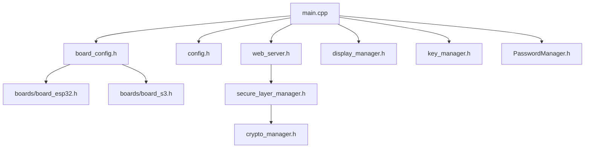

# Header Files Directory (`include/`)

This directory contains the header files (`.h`) defining the interfaces, data structures, and configuration constants of the **ESP32 T-Display TOTP** firmware. It also hosts the `web_pages/` subfolder, containing minified HTML, CSS, JavaScript, and helper assets served by the local web server.

---

## Core System Architecture

The codebase is designed as a modular, manager-based architecture. Different components communicate through unified headers and static or singleton manager classes.

---

## File Directory & Reference

Below is a detailed breakdown of all files located within the `include/` directory.

### Core Configuration & Boot
*   **`config.h`**
    Defines the main hardware and firmware configuration, pinouts, intervals, memory constraints, and directory paths for encrypted databases.
*   **`board_config.h`**
    Dynamic selector file that automatically includes either `boards/board_esp32.h` or `boards/board_s3.h` depending on the PlatformIO build target.
*   **`boards/board_esp32.h`**
    Hardware definitions for the LilyGo T-Display Classic (ESP32). Specifying pinouts for SPI, button pins, and battery monitoring channels.
*   **`boards/board_s3.h`**
    Hardware definitions for the LilyGo T-Display-S3 (ESP32-S3). Includes parallel display configurations, native USB-OTG pinouts, and custom sleep wakeup structures.
*   **`app_modes.h`**
    Defines the system-wide execution modes (`AppMode`) including TOTP Authenticator, Password Manager, AP mode, WiFi mode, and Offline mode.

### Security & Cryptography
*   **`crypto_manager.h`**
    The cryptographic core of the device. Handles AES-256 (CBC/GCM) encryption/decryption, PBKDF2 key derivation, random number generation (CTR_DRBG), and supports dual-slot volumes (`ActiveSpace::SPACE_A` / `ActiveSpace::SPACE_B`) for hidden spaces.
*   **`secure_layer_manager.h`**
    Secures browser-to-server communication using Elliptic Curve Diffie-Hellman (ECDH) key exchanges and symmetric transport encryption.
*   **`device_static_key.h`**
    Retrieves unique hardware identifiers (e.g. chip MAC address, flash ID) to derive device-bound static encryption keys.
*   **`pin_manager.h` & `PinManager.h`**
    Controls first-boot setup, startup PIN entry, duress PIN wipe triggers, lockout thresholds, and BLE pairing PIN prompts.
*   **`secure_utils.h`**
    Low-level memory safety utilities, such as `secure_memset`, to prevent compilers from optimization-based dead-store elimination at `-O3`.

### Network & Obfuscation Managers
*   **`web_server.h`**
    Declares the asynchronous web server engine, routes, session authentication tokens, and websocket handler classes.
*   **`web_server_secure_integration.h`**
    Glues the web server route dispatchers to the `SecureLayer` encrypted payload wrapper handlers.
*   **`web_admin_manager.h`**
    Admin API handler for firmware updates (OTA), data backups, space recovery, and factory resets.
*   **`wifi_manager.h`**
    Handles WiFi client connections, SSID scanning, credentials fallback, mDNS announcements, and automatic sleep timers for saving battery.
*   **`method_tunneling_manager.h`**
    Implements HTTP method tunneling to obscure API action signatures (e.g., encapsulating POST/DELETE requests inside tunnel envelopes).
*   **`url_obfuscation_manager.h` & `url_obfuscation_integration.h`**
    Generates dynamically rotating, time-bound endpoint paths to mask server routing schemas against network scanning.
*   **`traffic_obfuscation_manager.h` & `header_obfuscation_manager.h` & `header_obfuscation_integration.h`**
    Manages client-server transport signature camouflage by adding fake headers, variable packet padding, and dummy traffic to counter traffic analysis.

### Data & Credential Managers
*   **`key_manager.h`**
    Manages the encrypted database of TOTP/HOTP keys, custom sorting, counter synchronization, and dynamic API key validation.
*   **`PasswordManager.h`**
    Implements secure password management. Handles entry serialization, encryption, categorization, dynamic passwords generation, and duplicates checking.

### Display & Peripheral Management
*   **`display_manager.h`**
    Orchestrates the TFT LCD output. Draws current keys, timers, password badge indicators, charging details, status bars, and handles theme redraws.
*   **`animation_manager.h`**
    High-performance rendering engine that controls smooth transition animations using Q16.16 fixed-point math configuration.
*   **`battery_manager.h`**
    Reads analog battery levels (ADC), performs calibration, calculates charging status, and triggers low-battery warnings.
*   **`rtc_manager.h`**
    Initializes and communicates with the external DS3231 I2C RTC module to maintain correct offline time, drift logs, and browser syncing.
*   **`splash_manager.h`**
    Manages custom boot and splash screen drawings.
*   **`embedded_splashes.h` & `embedded_splashes_s3.h`**
    Pre-compiled static boot splash icons/binaries.
*   **`button_helpers.h`**
    Debounces physical buttons and maps clicks (single, double, long) considering the screen rotation.
*   **`usb_hid_manager.h`**
    Handles USB HID keyboard profile setup for the T-Display-S3 to type credentials onto computers directly.
*   **`ble_keyboard_manager.h`**
    Manages BLE keyboard emulation, pairing keys, client bonding, and password injection over Bluetooth.
*   **`log_manager.h`**
    Circular logging engine supporting log levels (DEBUG, INFO, WARNING, ERROR, CRITICAL), serial mirroring, and memory buffering.

---

## Web Console Assets (`include/web_pages/`)

The web cabinet interface is compiled into header resources to reside in Flash memory (`PROGMEM`), avoiding SPIFFS/LittleFS read overhead.

| File | Type | Description |
|---|---|---|
| `page_index.h` | C-string | The main UI app for managing credentials, settings, and themes. |
| `page_login.h` | C-string | The authentication screen for logging into the web cabinet. |
| `page_register.h` | C-string | Shown during first-boot to set up web cabinet credentials. |
| `page_splash.h` | C-string | Pre-authentication loading screen. |
| `page_wifi_setup.h`| C-string | Standalone setup utility for registering SSID and WiFi keys. |
| `page_test_encryption.h` | C-string | Web utility to test tunnel encapsulation, AES-GCM transport, and cryptography layers. |
| `secure_client.js` | JavaScript | Browser-side client library implementing ECDH and transport packet encryption. |
| `auto_secure_initializer.js` | JavaScript | Helper script automatically initializing the browser cryptographic environment. |
